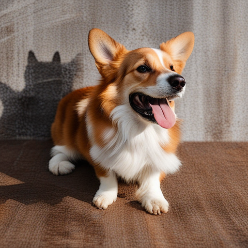

# A Deep Dive into InstanceDiffusion

## **Introduction**

In recent years, the field of generative modeling for text-to-image creation has had significant advancements, particularly with the invention of diffusion models[1]. These models have demonstrated their superior ability to generate high-quality images by iteratively refining random noise into coherent and very detailed images. 

However, these models often lack precise control over the placement and attributes of specific elements within an image, which limits their versatility in scenarios requiring detailed image customization. 

A groundbreaking contribution in this regard is the paper ["InstanceDiffusion: Instance-level Control for Image Generation"](https://arxiv.org/abs/2402.03290) by Xudong Wang, Trevor Darrell, Sai Saketh Rambhatla, and Rohit Girdhar introducing the InstanceDiffusion model [2]. This model addresses this limitation by allowing fine-grained control over attributes and locations of multiple instances within an image. Therefore, this enhances traditional text-to-image diffusion models by providing precise control over individual image instances.

In order for the model to achieve this core innovation (its ability to allow fine-grained control over attributes and locations of multiple instances within an image), the model incorporates several key components to achieve this level of control:

**UniFusion Block**: This block integrates various instance-level conditions into the same feature space, efficiently incorporating instance-level locations and text prompts into the visual tokens from the base diffusion model. This approach differs from previous methods that required separate architectures or complex preprocessing steps for different types of inputs. By unifying these inputs, the UniFusion block is responsible for this integration process.

**ScaleU Block**: The ScaleU block recalibrates the base features and the low-frequency components within the skip connections of the UNet architecture. This recalibration improves the fidelity and coherence of the generated images by ensuring that the model can better adhere to the specified layout conditions. It dynamically adjusts the scaling of these features, addressing the issue of blending high-level semantic information with detailed instance-level specifications.

**Multi-instance Sampler**: This final component addresses a common challenge in multi-instance generation: information leakage and confusion between the conditions of different instances. The Multi-instance Sampler reduces these issues by isolating the generation process of each instance, thereby preserving the distinct attributes and locations specified for each object. This isolation is achieved through a series of controlled sampling steps, which ensure that each instance is generated accurately and without interference from others.

Through these innovations, InstanceDiffusion significantly surpasses the performance of previous state-of-the-art models. The model demonstrates superior capabilities in scenarios that require complex instance specifications such as bounding boxes, instance masks, points, and scribbles. For example, on the COCO dataset, InstanceDiffusion outperforms prior models.

The practical implications of InstanceDiffusion are endless, particularly in fields where controlled image generation is crucial. In digital marketing, for instance, the ability to generate custom advertisements can significantly improve efficiency and help gain user engagement. Similarly, in content creation and interactive media, the precise control over instance attributes and locations can enable more dynamic and engaging visual storytelling. InstanceDiffusion paves the way for new applications and innovations in generative modeling by offering a higher degree of control and adaptability.

---

## **Related Work**

The development of InstanceDiffusion builds upon a huge body of work in the field of text-to-image generation and spatial controls in image synthesis. Previous models, such as Generative Adversarial Networks (GANs) and various forms of conditioned diffusion models, have made significant advances in creating realistic images from textual input.

#### Traditional Image Generation Models

Generative Adversarial Networks (GANs):
GANs have been very important in advancing image generation. They consist of a generator and a discriminator network, where the generator creates images, and the discriminator tries to separate real from generated. While GANs have produced impressive results, they often struggle with artifacts as well as training issues. Controlling specific elements within an image is deemed impossible due to their global generative nature.

#### Diffusion Models

Conditioned Diffusion Models:
Recent advancements in diffusion models have focused on conditioning mechanisms to control the generation process in specific ways. Notable works include GLIGEN [3] and ControlNet [4]. GLIGEN supports controlled image generation using similar conditions like bounding boxes [3]. However, it requires a separate model for each type of input, therefore increasing complexity and limiting flexibility. ControlNet on the other hand adds semantic segmentation masks to guide the image generation [3]. Similar to GLIGEN, this model also struggles with handling multiple input types simultaneously.

InstanceDiffusion addresses these limitations by introducing a unified approach that integrates multiple forms of instance-level conditions. This unified model enhances the versatility and accuracy of text-to-image diffusion models, allowing for more detailed and controlled image generation.

Therefore, InstanceDiffusion represents a significant step forward for generative models, offering unprecedented control and precision in image generation tasks. This model not only advances the technical capabilities of diffusion models but also opens new areas for practical applications in several fields such as digital marketing, content creation, and interactive media.

---

## **Exposition of Strengths, Weaknesses, and Potential**

The InstanceDiffusion model represents a significant advancement in the field of text-to-image generation. We critically examine its strengths, weaknesses, and the potential that inspired our group to further explore the model and investigate its limitations, particularly in handling overlapping content.

### Strengths

InstanceDiffusion excels in providing detailed control over each image instance given as input. The UniFusion Block integrates various forms of instance-level conditions into a unified feature space, allowing for the specification of instance locations using points, scribbles, bounding boxes, or segmentation masks. This flexibility significantly enhances the versatility of image generation. It manages to maintain high image fidelity largely due to the ScaleU Block. This dynamic adjustment ensures that the generated images adhere to specified layout conditions while keeping high visual quality.

The Multi-instance Sampler addresses the common challenge of information leakage between instances, ensuring that each object’s attributes and location are accurately represented. This leads to clearer and more distinct outputs, crucial for applications requiring precise instance differentiation. The model’s superior performance is evident through quantitative benchmarks.

InstanceDiffusion’s unified approach to handling various location inputs simplifies the model’s architecture and enlarges its applicability across different use cases. This generalization allows it to outperform specialized models tailored for specific conditions, providing a more robust and adaptable solution.

### Weaknesses

Despite its significant strengths, InstanceDiffusion has some weaknesses worth noting. The model struggles in scenarios involving overlapping instances, where it can lose clarity and distinction between objects in close proximity. This limitation can lead to artifacts or blending of features, significantly limiting its effectiveness in complex scenes with multiple overlapping objects. 

Additionally, while the unified approach simplifies integration, the implementation of the UniFusion and ScaleU blocks adds complexity. This can pose challenges for researchers and developers attempting to replicate or extend the model (like us), limiting its accessibility and ease of use.

Followingly, the enhanced capabilities of InstanceDiffusion come with increased computational requirements. Training and inference with this model demands significant computational resources, which limits its scalability and accessibility, particularly those with limited hardware capabilities.

Furthermore, the exploration of these instance attributes in the original paper is somewhat limited. 

### Potential and Motivation for Further Research

The highlighted strengths and weaknesses of InstanceDiffusion show several potential areas that motivated our group to explore the model further. Our primary focus was to investigate its limitations, particularly in handling overlapping instances. We aimed to understand and document the model’s performance in scenarios where instances overlap, identifying specific failure modes and potential areas for improvement.

In summary, InstanceDiffusion presents a robust framework for precise instance-level control in text-to-image generation. However, it also reveals handling overlapping content as a major bottleneck. Our group’s efforts therefore focused on testing the model and documenting its limitations, contributing potentially valuable insights that can inform future research and development in conditional generative modeling.

## **Novel Contribution and Experimental Results**

### **Novel Contribution**

Our work focuses on thoroughly testing the InstanceDiffusion model, particularly investigating its limitations in handling overlapping instances. Recognizing this issue highlighted in the original paper, we aimed to reproduce the authors’ findings and extend the investigation into specific scenarios where the model struggles.

We conducted an analysis of the model’s iterative generation process, emphasizing inputs defined by points and bounding boxes. By systematically varying the order and proximity of these inputs, we identified specific conditions under which the model fails to maintain clarity and consistency. 
This involved analyzing the generated images for artifacts and blending issues and assessing the model’s overall performance in maintaining instance clarity and distinction. 
Due to the significant computational requirements for reproducing the quantitative results as well as for actually extending the model, our goal was not to enhance the model but to provide a deeper understanding of its weaknesses and the conditions that made the model produce these failures. 

## Experimental Results

To validate our investigation, we conducted a series of experiments using several distinct visual conditions and semantic concepts. Our primary focus was on scenarios involving overlapping instances and iterative generation using points, scribbles, and bounding boxes.

In our first set of experiments, we designed scenarios where instances were defined by points, scribbles, and bounding boxes. By iteratively generating images with varying sequences and proximities of these instances, we observed how well the model maintained clarity and distinct features. Our findings revealed significant weaknesses in scenarios involving overlapping instances. For example, when generating a sequence of objects defined by points, the model often blended features, leading to unclear boundaries and artifacts. Similar issues were observed with scribbles and bounding boxes, particularly when objects were closely positioned. 

We identified that the UniFusion and ScaleU blocks, although effective in many scenarios, struggled to maintain distinct features when instances overlapped or were in close proximity. These observations were consistent across different types of inputs, suggesting inherent limitations in the model's architecture when dealing with complex spatial configurations.

To offer practical insights, we have documented our experiments in two separate files: one detailing the process for [reproduction](notes/RunPaper.md) and another describing the [additional experiments](notes/RunTests.md) we conducted. The results from these experiments can be found  in the following folders: [output](output) and [output_tests](output_tests).

#### Test 0

*Idea: restrictiveness in the inputs*

Each location input varies in its level of restrictiveness.

1. Points are least restrictive. They offers approximate location and minimal guidance on the size or shape of the instance.
2. Scribbles are a series of points that outline a rough path or shape on the image. Tey give a hint of form and orientation, however, they are still quite flexible, allowing the model freedom in interpreting the object’s exact boundaries.
3. Bounding boxes are rectangles which define the specific area an instance must occupy. However, they don't define the shape of the object within the box, only its extent.
4. Masks are the most restrictive input type. They define the precise pixel-wise location where the instance appears in the image and offer exact guidance on the shape and extent of the instance, leaving little to interpretation compared to the above methods.

We specified a river in the bottom left corner of a generated with the different input types image to visualize each of them would work:

ToDo

#### Test 1 

*Idea: close points*

We created an image of a panda with three balloons using point specifications. Following this, we generated another image decreasing the distance between the balloons. We observed the balloons often fail to generate correctly.

  
  

#### Test 2

*Idea: contradict perspective*

We generated images of a vase and a flower on a table using bounding boxes, specifying that the flower should be in the front. However, because we positioned the flower higher than the vase, the model often interpreted this as a perspective cue and often placed the flower behind the vase instead.

  
  

#### Test 3

*Idea: overlapping bounding boxes* 

We used bounding boxes to generate images featuring an apple and a pear, positioned at the same height and having the same size. We noticed that the model frequently generates the pear in front of the apple. We did not generate enough fruit images to draw a conclusion that the model is biased, however we decided to contradict the positioning explicitly specifying in the prompt that the apple should appear in front. We observed the model struggled to accurately generate the fruits, often producing a blended representation of the two.

With this test we visualized a weakness related to the Multi-instance Sampler which uses instance latents averaging. This approach is chosen for its compatibility with the different types of inputs as well as its ability to handle overlapping areas, however side effects are possible.

  
  

#### Test 4

*Idea: depth with scribbles*

We created a scene featuring a bear, an iceberg, and an igloo using bounding boxes. We tried to use the scribbles as cue whether the igloo or the iceberg should be in front. We attempted to position the igloo behind the iceberg by omitting points for the igloo in the overlapping area. We also tried omitting points for the iceberg at the overlapping area. This approach,  however, didn't. The same images were generated regardless of the scribbles.

In the UniFusion block different inputs are separately tokenized and fed to the encoder. It is described that adding more inputs improves the precision of the output, which we see in the demos, however, we notice that there is no effect in the case of adding scribbles.

  
  
  

#### Test 5

*Idea: experiment with a complex animal* 

We generated images of a complex animal facing both left and right. Specifically, we created images of a donkey with detailed bounding boxes for its head, mouth, and ears. We managed to get a very good output images. 

We successfully generated images of a complex animal facing both left and right. Specifically, we described a donkey using bounding boxes for its body, head, mouth, and ears, resulting in high-quality output images.

  
  

However, we also encountered some artifacts like two donkeys:

  
  

## **Future Work**

Future work could aim to improve the model's spatial understanding by incorporating object ordering into the input. This would involve integrating a dataset that includes depth or object order information and retraining the model to capture the positional relationships of objects. Additionally, this approach could enable the use of the Multi-instance Sampler with a crop-and-paste method, addressing issues related to the close proximity and overlap of objects, and enhancing the contextual accuracy of the generated images.

## **Conclusion**

Our exploration of the InstanceDiffusion model has yielded significant insights, reinforcing the model's potential in the domain of text-to-image generation. This research aimed to reproduce the original findings and investigate specific limitations, particularly in handling overlapping instances.

We successfully reproduced the original results of the InstanceDiffusion model, confirming its superior performance in generating precise and high-quality images based on instance-level conditions. This validation underscores the robustness of the UniFusion Block, ScaleU Block, and Multi-instance Sampler.

Through our experiments, we identified significant weaknesses in the model's performance when handling overlapping instances. By systematically varying the order and proximity of inputs defined by points, scribbles, and bounding boxes, we observed that the model often struggled to maintain clarity and distinct features. These findings highlight the challenges the model faces in maintaining the separation and accurate representation of closely positioned objects.

Our work has focused on testing the InstanceDiffusion model more extensively and investigating its failure modes, particularly in scenarios involving overlapping instances. This detailed analysis provides valuable insights into the model's limitations and areas where further research is needed.

The InstanceDiffusion model demonstrates significant potential in various industries requiring detailed and customizable image generation, such as digital marketing, content creation, and interactive media. However, our findings emphasize the need for further development to enhance the model's ability to manage overlapping instances and complex spatial configurations.

The InstanceDiffusion model represents a notable advancement in text-to-image generation, and our investigation has highlighted both its strengths and limitations. By thoroughly testing the model and identifying key areas for improvement, we have contributed to a deeper understanding of instance-level control in image generation. Our work sets the stage for future research aimed at addressing these challenges and advancing the capabilities of generative models.

## Contributions

## Bibliography

[1]: L. Yang, Z. Zhang, Y. Song, S. Hong, R. Xu, Y. Zhao, W. Zhang, B. Cui, and M.-H. Yang, "Diffusion models: A comprehensive survey of methods and applications," ACM Computing Surveys, vol. 56, no. 4, pp. 1-39, 2023.

[2]: X. Wang, T. Darrell, S. S. Rambhatla, and R. Girdhar, "InstanceDiffusion: Instance-level Control for Image Generation," 2024. [Online]. Available: [https://arxiv.org/abs/2402.03290](https://arxiv.org/abs/2402.03290).

[3]: Y. Ren, L. Li, Z. Zhang, X. Li, J. Tang, "GLIGEN: Group-Level Image Generation with Interactions," 2024. [Online]. Available: [https://arxiv.org/abs/2103.02174](https://arxiv.org/abs/2103.02174).

[4]: Y. Liu, X. Zhang, H. Wang, T. Yang, B. Gu, "ControlNet: Adding Conditional Control to Text-to-Image Diffusion Models," 2024. [Online]. Available: [https://arxiv.org/abs/2302.05543](https://arxiv.org/abs/2302.05543).