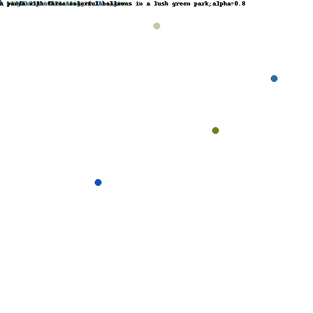
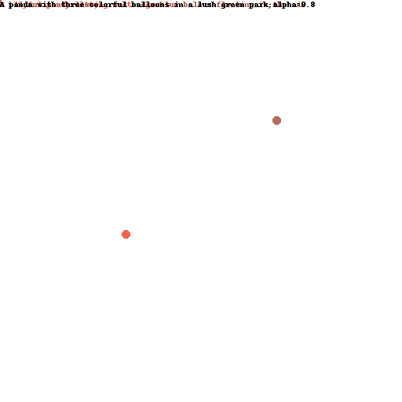
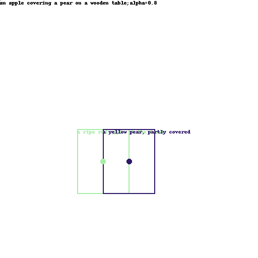

# A Deep Dive into InstanceDiffusion

This blog post explores and expands upon the findings presented in the CVPR 2024 paper titled “InstanceDiffusion: Instance-level Control for Image Generation” by Wang et al.[1]. The paper introduces the InstanceDiffusion model, a significant advancement in text-to-image diffusion models that allows for precise control over individual instances in an image. This model allows various instance location specifications as well as text input, demonstrating superior performance over state-of-the-art models.

The purpose of this blog post is to:

   •  Help other researchers understand the InstanceDiffusion model.

   •  Analyze and investigate the model’s limitations and shortcomings.

## **Introduction**

In recent years, the field of generative modeling for text-to-image creation has had significant advancements, particularly with the invention of diffusion models[1]. These models have demonstrated their superior ability to generate high-quality images by iteratively refining random noise into coherent and very detailed images.

However, these models often lack precise control over the placement and attributes of specific elements within an image, which limits their versatility in scenarios requiring detailed image customization. This control is crucial for a number of design applications in generative modeling.

A groundbreaking contribution in this regard is the paper ["InstanceDiffusion: Instance-level Control for Image Generation"](https://arxiv.org/abs/2402.03290) by Xudong Wang, Trevor Darrell, Sai Saketh Rambhatla, and Rohit Girdhar introducing the InstanceDiffusion model [2]. This model addresses this limitation by allowing fine-grained control over attributes and locations of multiple instances within an image. Therefore, this enhances traditional text-to-image diffusion models by providing precise control over individual image instances.

### Model Architecture & Details

In order for the model to achieve its ability to allow fine-grained control over attributes and locations of multiple instances within an image, the model incorporates several key components to achieve this level of control:

**UniFusion Block**: This block integrates various instance-level conditions into the same feature space, efficiently incorporating instance-level locations and text prompts into the visual tokens from the base diffusion model. Unlike previous methods, this approach does not require separate architectures or complex preprocessing steps for different types of inputs. The UniFusion block is responsible for this integration process and is placed between the self-attention and cross-attention layers of the base model. During location parameterization, numerous location formats are transformed into 2D points on which the Instance Tokenizer applies a Fourier mapping. The text prompt is encoded using a CLIP text encoder and these embeddings (location and text) are then turned to a single token embedding for each instance through an MLP. Another important part plays the instance masked attention preventing information leakage across instances.

**ScaleU Block**: The ScaleU block introduces two learnable, channel-wise vectors for the main and skip-connected features. They are integrated into each UNET's decoder blocks and by dynamically adjusting the scaling of these features, it ensures a balance between global and fine-grained structures, addressing the issue of blending them together. For the skip-connected features only the low-frequency components are selected. This recalibration improves the fidelity and coherence of the generated images by ensuring that the model can better adhere to the specified layout conditions.

**Multi-instance Sampler**: The final component addresses a common challenge in multi-instance generation; information leakage and confusion between the conditions of different instances. The Multi-instance Sampler reduces these issues by separating the denoising process of each instance, thereby preserving the distinct attributes and locations specified for each object. This isolation is achieved through a series of controlled sampling steps, which ensure that each was generated without interference from others. These individual latents are then combined with the global latent by averaging. This component can easily be used to improve other location-conditioned models.

Through these innovations, InstanceDiffusion significantly surpasses the performance of previous state-of-the-art models. The model demonstrates superior capabilities in scenarios that require complex instance specifications such as bounding boxes, instance masks, points, and scribbles. For example, on the COCO dataset, InstanceDiffusion outperforms prior models significantly in various metrics.

The practical implications of InstanceDiffusion are endless, particularly in fields where controlled image generation is crucial. In digital marketing, for instance, the ability to generate custom advertisements can significantly improve efficiency and help gain user engagement. Similarly, in content creation and interactive media, the precise control over instance attributes and locations can enable more dynamic and engaging visual storytelling. InstanceDiffusion paves the way for new applications and innovations in generative modeling by offering a higher degree of control and adaptability.

---

### **Related Work**

Diffusion models for image generation have garnered significant interest in recent years due to their ability to produce high quality images through reiterated denoising.
The development of InstanceDiffusion builds upon a huge body of work in the field of text-to-image generation and spatial controls in image synthesis. Previous models, such as Generative Adversarial Networks (GANs) and various forms of conditioned diffusion models, have made significant advances in creating realistic images from textual input.

#### Traditional Image Generation Models

Traditional text-to-image models, such as Generative Adversarial Networks (GANs), rely on two seperate networks to create images from textual descriptions. While GANs have been successfully producing high-quality images, they struggle with stability during training, artifacts and certainly a lack of precise control over specific elements in the image.

#### Diffusion Models

In contrast, diffusion models, such as Denoising Diffusion Models (DDPMs) and score-based generative models (SGMs), work by progressively adding noise to an image and are only learning to reverse the process to generate samples. This allows for a more iterative and refined image generation and additionally enhances image quality and provides better control over the generation process.

#### Conditioned Diffusion Models

Most recent advancements in diffusion models have focused on conditioning mechanisms to control the generation process in specific ways. Notable works include GLIGEN [3] and ControlNet [4]. GLIGEN supports controlled image generation using similar conditions like bounding boxes [3]. However, it requires a separate model for each type of input, therefore increasing complexity and limiting flexibility. ControlNet on the other hand adds semantic segmentation masks to guide the image generation [4]. Similar to GLIGEN, this model also struggles with handling multiple input types simultaneously.

InstanceDiffusion addresses these limitations by introducing a unified approach that integrates multiple forms of instance-level conditions. This unified model enhances the versatility and accuracy for detailed and customized image generation tasks.

---

## **Exposition of Strengths, Weaknesses, and Potential**

The InstanceDiffusion model represents a significant advancement in the field of text-to-image generation, offering unprecedented control and precision in image generation tasks. We critically examine its strengths, weaknesses, and the potential that inspired our group to further explore the model and investigate its limitations, particularly in handling overlaps.

### Strengths

InstanceDiffusion excels in providing detailed control over each image instance given as input. The UniFusion Block integrates various forms of instance-level conditions into a unified feature space, allowing for the specification of instance locations using points, scribbles, bounding boxes, or segmentation masks. This flexibility significantly enhances the versatility of image generation. It manages to maintain high image fidelity largely due to the ScaleU Block. This dynamic adjustment ensures that the generated images adhere to specified layout conditions while keeping high visual quality.

The Multi-instance Sampler addresses the common challenge of information leakage between instances, ensuring that each object’s attributes and location are accurately represented. This leads to clearer and more distinct outputs, crucial for applications requiring precise instance differentiation. The model’s superior performance is evident through quantitative benchmarks.

InstanceDiffusion’s unified approach to handling various location inputs simplifies the model’s architecture and enlarges its applicability across different use cases. This generalization allows it to outperform specialized models tailored for specific conditions, providing a more robust and adaptable solution.

### Weaknesses

Despite its significant strengths, InstanceDiffusion has some weaknesses worth noting. The model struggles in scenarios with overlapping instances, where it can easily lose clarity and distinction between objects in close proximity. This limitation can lead to artifacts or blending of features, significantly limiting its effectiveness in complex scenes with multiple overlapping objects.

Additionally, while the unified approach simplifies integration, the implementation of the UniFusion and ScaleU blocks adds complexity. This can pose challenges for researchers or small teams (like us) attempting to replicate or extend the model, limiting its accessibility and ease of use.

Therefore, the enhanced capabilities of InstanceDiffusion come with significant computational requirements. Training and inference with this model demands significant computational resources, which limits its scalability and accessibility, particularly those with limited hardware capabilities.

Finally, the exploration of these instance attributes in the original paper is quiet limited.

### Motivation for Further Research

The highlighted strengths and weaknesses of InstanceDiffusion show several potential areas that motivated our group to explore the model further. Due to the need of a lot of computational resources as well as a lack of information regarding its limitations, particularly in handling overlapping instances. We aimed to understand and document the model’s performance in scenarios where instances overlap, identifying specific failure modes and potential areas for improvement.

In summary, InstanceDiffusion presents a robust framework for precise instance-level control in text-to-image generation. However, it also reveals handling overlapping content as a major bottleneck. Our group’s efforts therefore focused on testing the model and documenting its limitations, contributing potentially valuable insights that can inform future research and development in conditional generative modeling.

## **Novel Contribution and Experimental Results**

### **Novel Contribution**

Our work focuses on thoroughly testing the InstanceDiffusion model, particularly investigating its limitations in handling overlapping instances. Recognizing this issue highlighted in the original paper, we aimed to reproduce the authors’ findings in this regard and extend the investigation into specific scenarios where the model struggles.

We conducted an analysis of the model’s iterative generation process, emphasizing inputs defined by points and bounding boxes. By systematically varying the order and proximity of these inputs, we identified specific conditions under which the model fails to maintain clarity and consistency.
This involved analyzing the generated images for artifacts and blending issues and assessing the model’s overall performance in maintaining instance clarity and distinction.
Due to the significant computational requirements for reproducing the quantitative results as well as for extending the model, our goal was to provide a deeper understanding of its weaknesses and the conditions that made the model produce these failures.

## Experimental Results

To validate our investigation, we conducted a series of experiments using several distinct visual conditions and semantic concepts. Our primary focus was on scenarios involving overlapping instances and iterative generation using points, scribbles, and bounding boxes.

In our first set of experiments, we designed scenarios where instances were defined by points, scribbles, and bounding boxes. By iteratively generating images with varying sequences and proximities of these instances, we observed how well the model maintained clarity and distinct features. Our findings revealed significant weaknesses in scenarios involving overlapping instances. For example, when generating a sequence of objects defined by points, the model often blended features, leading to unclear boundaries and artifacts. Similar issues were observed with scribbles and bounding boxes, particularly when objects were closely positioned. 

To offer practical insights, we have documented our experiments in two separate files: one detailing the process for [reproduction](notes/RunPaper.md) and another describing the [additional experiments](notes/RunTests.md) we conducted. The results from these experiments can be found  in the following folders: [output](output) and [output_tests](output_tests).

#### Test 0

We used different position inputs to describe a certain position of a corgi to visualize how each of them would work.

  
  
  
  
  
  
  
  

**Figure 0** Images showing a corgi dog in the image center with varying input restrictiveness: points, scribbles, bounding boxes, and masks.

#### Test 1 

We created an image of a panda with three balloons using point specifications. Following this, we generated another image decreasing the distance between the balloons. We observed the balloons often fail to generate correctly.

  
  
  
  
  
  

**Figure 1** Images of a panda with balloons using point inputs. Balloons are correctly placed (top) and incorrectly placed when closer together (bottom).

#### Test 2

We used bounding boxes to generate images featuring an apple and a pear, positioned at the same height and having the same size. We noticed that the model frequently generates the pear in front of the apple. We did not generate enough fruit images to draw a conclusion that the model is biased, however we decided to contradict the positioning explicitly specifying in the prompt that the apple should appear in front. We observed the model struggled to accurately generate the fruits, often producing a blended representation of the two.

  
  
  
  

  
  
  
  
  
  

**Figure 2** Images of a vase and flower using bounding boxes. Flower placement is incorrect due to perspective cues (bottom), despite specifying the flower should be in front.

#### Test 3

We used bounding boxes to define the positions of a vase, a flower and a table. We explicitly specified in the prompt that the flower should be in the front.

  
  
  
  

**Figure 3** Images of an apple and pear using overlapping bounding boxes. The model struggles with correct placement, often blending the two fruits.

#### Test 4

We created a scene featuring a bear, an iceberg, and an igloo using bounding boxes. We tried to add scribbles as cue whether the igloo or the iceberg should be in front. We attempted to position the igloo behind the iceberg by positioning the scribbles for the igloo away fron the overlapping area. We also tried the same with the iceberg. This approach, however, didn't work. Similar images were generated.

  
  
  
  
  
  

**Figure 4**  Scenes with a bear, iceberg, and igloo using bounding boxes and scribbles. Scribbles did not affect the depth placement as intended.

#### Test 5

We generated images of a complex animal oriented both left and right. Specifically, we created images of a donkey, providing detailed bounding boxes for its head, mouth, and ears. This approach resulted in high-quality output images.

  
  
  
  
  
  

We also encountered some artifacts:

  
  

**Figure 5** Images of a donkey facing left and right using bounding boxes. Successful outputs (top) and artifacts like generating two donkeys (bottom).

### **Experimental Results**

We identified that the UniFusion and ScaleU blocks, although effective in many scenarios, struggled to maintain distinct features when instances overlapped or were in close proximity. These observations were consistent across different types of inputs, suggesting inherent limitations in the model's architecture when dealing with complex spatial configurations.

With *Test 0* we showcased the different location inputs and their variability in the level of restrictiveness:
1. Points are least restrictive. They offers approximate location and minimal guidance on the size or shape of the instance.
2. Scribbles are a series of points that outline a rough path or shape on the image. Tey give a hint of form and orientation, however, they are still quite flexible, allowing the model freedom in interpreting the object’s exact boundaries.
3. Bounding boxes are rectangles which define the specific area an instance must occupy. However, they don't define the shape of the object within the box, only its extent.
4. Masks are the most restrictive input type. They define the precise pixel-wise location where the instance appears in the image and offer exact guidance on the shape and extent of the instance, leaving little to interpretation compared to the above methods.

With *Test 1* we investigated the model’s performance with points as input. Initially, the balloons were placed with large distance between them, resulting in clear and distinct features. However, when decreasing the distance between the balloons, the model failed to generate them correctly, blending features and creating unclear boundaries. This visualized information leakage between instances placed close to each other. They significantly affected each other’s attributes despite the improvements made by the Multi-instance Sampler. 

With *Test 2*, we explored how the model’s manages with positioning cues using bounding boxes. This showed that instances can blend together during the averaging process. Specifically, we encountered the issue then we attempted to provide instructions for which fruit is in front.

With *Test 3* we showed that describing unusual positions for objects may lead to inconsistent or poor results. The position of the flower in relation to the prompt contradicted the physics of perspective. We chose to visualize this not because it showcases a difference in the instance diffusion implementation, but because we believe it offers an interesting observation that could enhance the understanding of how the model works.

With *Test 4* we showed that in the case of using bounding boxes, scribbles have little effect. We attribute this to the bounding box being a more restrictive input, however more investigations are needed.

With *Test 5* we successfully tested the generation of a complex animal facing both left and right. We showed high-quality output images, despite some artifacts.

## **Future Work**

Future work could aim to improve the model's spatial understanding by incorporating object ordering into the input. This would involve integrating a dataset that includes depth or object order information and retraining the model to capture the positional relationships of objects. Additionally, this approach could explore the use of the Multi-instance Sampler with a crop-and-paste method further, addressing issues related to the close proximity and overlap of objects, and resulting in more precise and contextually accurate generations.

## **Conclusion**

Our exploration of the InstanceDiffusion model has provided significant insights, reinforcing the model's potential in the domain of text-to-image generation. This research aimed to reproduce the original findings and investigate specific limitation in handling overlapping instances.

We successfully generated some of the original images of the InstanceDiffusion model, confirming its superior performance in generating precise and high-quality images based on instance-level conditions.

Through our experiments, we identified significant weaknesses in the model's performance when handling overlapping instances. The model often struggled to maintain clarity and distinct features. These findings highlight the challenges the model faces in maintaining a separation and an accurate representation of closely positioned objects while producing logically sound images.

The InstanceDiffusion model demonstrates significant potential in various industries which require detailed and customizable image generation. However, our findings emphasize the need for further development to enhance the model's ability to manage more complex spatial configurations and efficiency improvements.

## Contributions

Both team members worked together to get the authors github repository to work in our environment as well as organizational planning. Afterwards, while still cooperating for most of the work, Valentina took charge of the implementation of the experiments and Simon took control of research and writing process.

## Bibliography

[1]: L. Yang, Z. Zhang, Y. Song, S. Hong, R. Xu, Y. Zhao, W. Zhang, B. Cui, and M.-H. Yang, "Diffusion models: A comprehensive survey of methods and applications," ACM Computing Surveys, vol. 56, no. 4, pp. 1-39, 2023.

[2]: X. Wang, T. Darrell, S. S. Rambhatla, and R. Girdhar, "InstanceDiffusion: Instance-level Control for Image Generation," 2024. [Online]. Available: [https://arxiv.org/abs/2402.03290](https://arxiv.org/abs/2402.03290).

[3]: Y. Ren, L. Li, Z. Zhang, X. Li, J. Tang, "GLIGEN: Group-Level Image Generation with Interactions," 2024. [Online]. Available: [https://arxiv.org/abs/2103.02174](https://arxiv.org/abs/2103.02174).

[4]: Y. Liu, X. Zhang, H. Wang, T. Yang, B. Gu, "ControlNet: Adding Conditional Control to Text-to-Image Diffusion Models," 2024. [Online]. Available: [https://arxiv.org/abs/2302.05543](https://arxiv.org/abs/2302.05543).