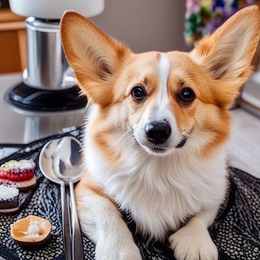

# A Deep Dive into InstanceDiffusion

## **Introduction**

In recent years, the field of generative models for image creation has witnessed significant advancements, particularly with the advent of diffusion models. These models have demonstrated an unparalleled ability to generate high-quality images by iteratively refining random noise into coherent and detailed visual outputs. One of the groundbreaking contributions in this domain is the paper titled[ "InstanceDiffusion: Instance-level Control for Image Generation"](https://arxiv.org/abs/2402.03290) by Xudong Wang, Trevor Darrell, Sai Saketh Rambhatla, and Rohit Girdhar. This paper introduces the InstanceDiffusion model, which enhances traditional text-to-image diffusion models by providing precise control over individual image instances.
The core innovation of InstanceDiffusion lies in its ability to allow fine-grained control over the attributes and locations of multiple instances within an image. 

The model incorporates several key components to achieve this level of control:

**UniFusion Block**: This block integrates various forms of instance-level conditions into the same feature space, seamlessly incorporating instance-level locations and text prompts into the visual tokens from the diffusion model. This approach contrasts with previous methods that often required separate architectures or complex preprocessing steps for different types of location inputs. By unifying these inputs, the UniFusion block simplifies the integration process and enhances the model's flexibility.

**ScaleU Block**: The ScaleU block recalibrates both the main features and the low-frequency components within the skip connections of the UNet architecture. This recalibration ensures that the model can better adhere to the specified layout conditions, improving the fidelity and coherence of the generated images. The ScaleU block dynamically adjusts the scaling of these features, addressing the challenge of blending high-level semantic information with detailed instance-level specifications.

**Multi-instance Sampler**: This component addresses a common issue in multi-instance generation: information leakage and confusion between the conditions of different instances. The Multi-instance Sampler mitigates these issues by isolating the generation process of each instance, thereby preserving the distinct attributes and locations specified for each object. This isolation is achieved through a series of controlled sampling steps, which ensure that each instance is generated accurately and without interference from others.

Through these innovations, InstanceDiffusion significantly surpasses the performance of previous state-of-the-art models. The model demonstrates superior capabilities in scenarios that require complex instance specifications such as bounding boxes, instance masks, points, and scribbles. For example, on the COCO dataset, InstanceDiffusion outperforms prior models by 20.4% APbox_50 for box inputs and 25.4% IoU for mask inputs. This marked improvement highlights the model's ability to generate images that are not only realistic but also precisely controlled according to user-defined parameters.

The practical implications of InstanceDiffusion are vast, particularly in fields where customized and controlled image generation is crucial. In digital marketing, for instance, the ability to generate tailored advertisements with specific product placements can significantly enhance user engagement. Similarly, in content creation and interactive media, the precise control over instance attributes and locations can enable more dynamic and engaging visual storytelling. By offering a higher degree of control and flexibility, InstanceDiffusion paves the way for new applications and innovations in generative modeling.

---

## **Related Work**

The development of InstanceDiffusion builds on a rich body of work in the field of text-to-image generation and spatial controls in image synthesis. Previous models, such as Generative Adversarial Networks (GANs) and various forms of conditioned diffusion models, have made significant strides in creating realistic images from textual descriptions. Notable works include GLIGEN, which supports controlled image generation using discrete conditions like bounding boxes, and ControlNet, which focuses on adding semantic segmentation masks to guide the image generation process. However, these models often lack the flexibility and precision required for detailed instance-level control. For instance, GLIGEN and ControlNet require training separate models for each type of controllable input, increasing overall complexity and limiting their ability to capture interactions across various inputs. InstanceDiffusion addresses these limitations by introducing a unified approach that integrates multiple forms of instance-level conditions, thereby enhancing the versatility and accuracy of text-to-image diffusion models.

InstanceDiffusion represents a significant step forward in the evolution of generative models, offering unprecedented control and precision in image generation tasks. This model not only advances the technical capabilities of diffusion models but also opens new avenues for practical applications in fields such as digital marketing, content creation, and interactive media.

---

## **Exposition of Strengths, Weaknesses, and Potential of InstanceDiffusion**

The InstanceDiffusion model represents a significant advancement in the field of text-to-image generation, offering precise control over individual instances within an image. Here, we critically examine its strengths, weaknesses, and the potential that inspired our group's response to further explore the model and investigate its limitations, particularly in handling overlapping content.

### **Strengths**

InstanceDiffusion excels in providing detailed control over each image instance. The UniFusion Block integrates various forms of instance-level conditions into a unified feature space, allowing for the specification of instance locations using points, scribbles, bounding boxes, or segmentation masks. This flexibility significantly enhances the precision of image generation. Another notable strength is the model's ability to maintain high image fidelity, largely due to the ScaleU Block, which recalibrates both the main features and the low-frequency components within the UNet architecture's skip connections. This dynamic adjustment ensures that the generated images adhere to specified layout conditions while exhibiting high visual quality.

The Multi-instance Sampler addresses the common challenge of information leakage between instances, ensuring that each object's attributes and location are accurately represented. This leads to clearer and more distinct outputs, crucial for applications requiring precise instance differentiation. The model's superior performance is evident through quantitative benchmarks, achieving significant improvements in metrics such as APbox_50 and IoU on the COCO dataset. This highlights its effectiveness in generating precise and high-quality images.

InstanceDiffusion's unified approach to handling various location inputs simplifies the model's architecture and broadens its applicability across different use cases. This generalization allows it to outperform specialized models tailored for specific conditions, providing a more robust and adaptable solution.

### **Weaknesses**

Despite its strengths, InstanceDiffusion has notable weaknesses. The model struggles in scenarios involving overlapping instances, where it can lose clarity and distinction between objects in close proximity. This limitation can lead to artifacts or blending of features, hindering its effectiveness in complex scenes with multiple interacting objects. Additionally, while the unified approach simplifies integration, the implementation of the UniFusion and ScaleU blocks adds complexity. This can pose challenges for researchers and developers attempting to replicate or extend the model, potentially limiting its accessibility and ease of use.

The enhanced capabilities of InstanceDiffusion come at the cost of increased computational requirements. Training and inference with this model demand significant computational resources, which may limit its scalability and accessibility for some applications, particularly those with limited hardware capabilities. Furthermore, although the model allows for fine-grained control over instance attributes, the exploration of these attributes in the original paper is somewhat limited. There is potential for further research into managing and utilizing variations in color, texture, and other attributes more effectively.

### **Potential and Motivation for Further Research**

The strengths and weaknesses of InstanceDiffusion highlight several areas of potential that motivated our group to explore the model further. Our primary focus was to investigate its limitations, particularly in handling overlapping instances. We aimed to understand and document the model's performance in scenarios where instances overlap, identifying specific failure modes and potential areas for improvement.

Our research did not involve improving the model itself but rather testing the authors' implementation under various conditions to thoroughly evaluate its robustness. By designing experiments that specifically targeted overlapping instances, we aimed to provide a clearer picture of the model's capabilities and limitations. This involved analyzing the generated images for artifacts and blending issues and assessing the model's overall performance in maintaining instance clarity and distinction.

In summary, InstanceDiffusion presents a robust framework for precise instance-level control in text-to-image generation. However, it also reveals areas ripe for further investigation, particularly in handling overlapping content. Our group's efforts focused on rigorously testing the model and documenting its limitations, contributing valuable insights that can inform future research and development in generative modeling.

---

## **Novel Contribution and Experimental Results**

### **Novel Contribution**

Our work focuses on thoroughly testing the InstanceDiffusion model, particularly investigating its limitations in handling overlapping instances. Recognizing the challenges highlighted in the original paper, we aimed to reproduce the authors' findings and extend the investigation into specific scenarios where the model struggles.

We conducted a detailed analysis of the model's iterative generation process, emphasizing inputs defined by points, scribbles, and bounding boxes. By systematically varying the order and proximity of these inputs, we identified specific conditions under which the model fails to maintain clarity and consistency. Our goal was not to enhance the model but to provide a deeper understanding of its weaknesses and the conditions that exacerbate these failures.

### **Experimental Results**

To validate our investigation, we conducted a series of experiments using several distinct visual conditions and semantic concepts. Our primary focus was on scenarios involving overlapping instances and iterative generation using points, scribbles, and bounding boxes.

In our first set of experiments, we designed scenarios where instances were defined by points, scribbles, and bounding boxes. By iteratively generating images with varying sequences and proximities of these instances, we observed how well the model maintained clarity and distinct features. Our findings revealed significant weaknesses in scenarios involving overlapping instances. For example, when generating a sequence of objects defined by points, the model often blended features, leading to unclear boundaries and artifacts. Similar issues were observed with scribbles and bounding boxes, particularly when objects were closely positioned. 

We identified that the UniFusion and ScaleU blocks, although effective in many scenarios, struggled to maintain distinct features when instances overlapped or were in close proximity. These observations were consistent across different types of inputs, suggesting inherent limitations in the model's architecture when dealing with complex spatial configurations.

To offer practical insights, we have documented our experiments in two separate files: one detailing the process for [reproduction](notes/RunPaper.md) and another describing the [additional experiments](notes/RunTests.md) we conducted. The results from these experiments can be found  in the following folders: [output](output) and [output_tests](output_tests).

#### Test 0

*Idea: restrictiveness in the inputs*

Each location input varies in its level of restrictiveness.

1. Points are least restrictive. They offers approximate location and minimal guidance on the size or shape of the instance.
2. Scribbles are a series of points that outline a rough path or shape on the image. Tey give a hint of form and orientation, however, they are still quite flexible, allowing the model freedom in interpreting the object’s exact boundaries.
3. Bounding boxes are rectangles which define the specific area an instance must occupy. However, they don't define the shape of the object within the box, only its extent.
4. Masks are the most restrictive input type. They define the precise pixel-wise location where the instance appears in the image and offer exact guidance on the shape and extent of the instance, leaving little to interpretation compared to the above methods.

We specified a river in the bottom left corner of a generated with the different input types image to visualize each of them would work:

ToDo

#### Test 1 

*Idea: close points*

We created an image of a panda with three balloons using point specifications. Following this, we tried to decrease the distance generated another image where the balloons were positioned closer together. We observed the balloons often fail to generate correctly.

  
  

#### Test 2

*Idea: contradict perspective*

We generated images of a vase and a flower on a table using bounding boxes, specifying that the flower should be in the front. However, because we positioned the flower higher than the vase, the model often interpreted this as a perspective cue and often placed the flower behind the vase instead.

  
  

*Note: Restricting the model too much to weird positionings of objects might cause poor quality of the generated images.*

#### Test 3

*Idea: overlapping bounding boxes* 

We used bounding boxes to generate images featuring an apple and a pear, positioned at the same height and having the same size. We noticed that the model frequently generates the pear in front of the apple, regardless of the order of the fruits. We decided to contradict that explicitly specifying that the apple should appear in front. We observed the model struggled to accurately generate the fruits, often producing a blended representation of the two.

  
  

#### Test 4

*Idea: crossing scribbles*

We created a scene featuring a bear, an iceberg, and an igloo using bounding boxes and scribbles in addition to them. We tried to ise the scribbles as cue whether the igloo or the iceberg should be in front. In the first scenario, we positioned the igloo behind the iceberg by omitting points for the igloo in the overlapping area. In the second scenario, we reversed their positions. However, this approach was unsuccessful as it produced inconsistent results, with some images showing igloos in front of icebergs and others showing them behind, regardless of the specified scribbles.

<!-- ToDo: test only scribbles -->

  
  
  

#### Test 5

*Idea: experiment with a complex animal* 

We generated images of a complex animal facing both left and right. Specifically, we created images of a donkey with detailed bounding boxes for its head, mouth, and ears. We managed to get a very good output images. 

We successfully generated images of a complex animal facing both left and right. Specifically, we described a donkey using bounding boxes for its body, head, mouth, and ears, resulting in high-quality output images.

<!-- 

  
  

 -->

  
  

However, we also encountered some artifacts like two donkeys:

  
  

## **Future Work**

Future work could focus on enhancing the model's spatial understanding by incorporating object ordering into the input. This enhancement will require the integration of a dataset that provides depth or object order information, such as the NYU Depth Dataset V2 or the KITTI Vision Benchmark Suite. The model will require adjustments to effectively interpret this spatial data, followed by comprehensive retraining to ensure it accurately reflects the depth and positional relationships of objects, thus improving the realism and contextual accuracy of the generated images.

## **Conclusion**

Our exploration of the InstanceDiffusion model has yielded significant insights, reinforcing the model's potential in the domain of text-to-image generation. This research aimed to reproduce the original findings and investigate specific limitations, particularly in handling overlapping instances.

We successfully reproduced the original results of the InstanceDiffusion model, confirming its superior performance in generating precise and high-quality images based on instance-level conditions. This validation underscores the robustness of the UniFusion Block, ScaleU Block, and Multi-instance Sampler.

Through our experiments, we identified significant weaknesses in the model's performance when handling overlapping instances. By systematically varying the order and proximity of inputs defined by points, scribbles, and bounding boxes, we observed that the model often struggled to maintain clarity and distinct features. These findings highlight the challenges the model faces in maintaining the separation and accurate representation of closely positioned objects.

Our work has focused on testing the InstanceDiffusion model more extensively and investigating its failure modes, particularly in scenarios involving overlapping instances. This detailed analysis provides valuable insights into the model's limitations and areas where further research is needed.

The InstanceDiffusion model demonstrates significant potential in various industries requiring detailed and customizable image generation, such as digital marketing, content creation, and interactive media. However, our findings emphasize the need for further development to enhance the model's ability to manage overlapping instances and complex spatial configurations.

The InstanceDiffusion model represents a notable advancement in text-to-image generation, and our investigation has highlighted both its strengths and limitations. By thoroughly testing the model and identifying key areas for improvement, we have contributed to a deeper understanding of instance-level control in image generation. Our work sets the stage for future research aimed at addressing these challenges and advancing the capabilities of generative models.
