

  
  

  
  

  
  

  
  

---

  
  

  
  

  
  
  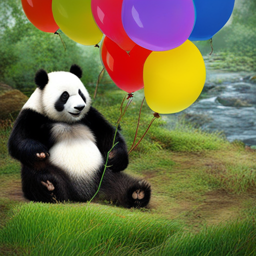
  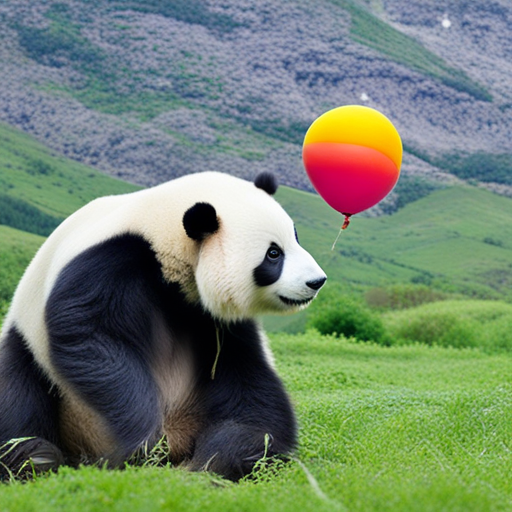

---

  
  
  

  
  

  
  
  
  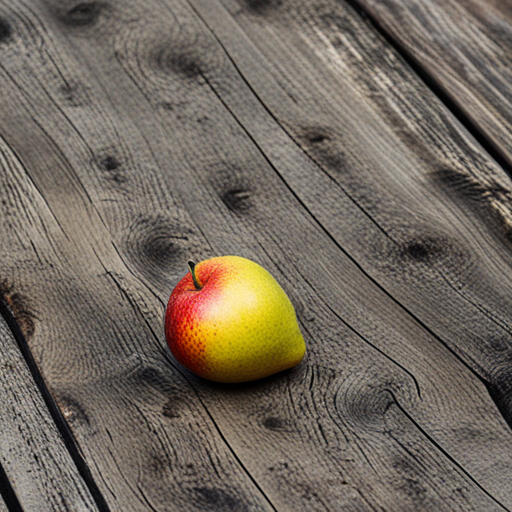

  
  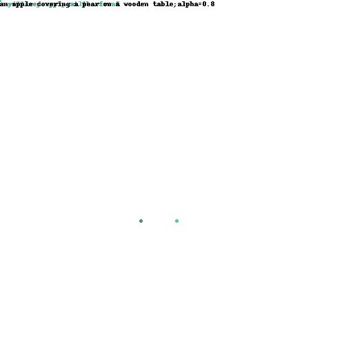
  
  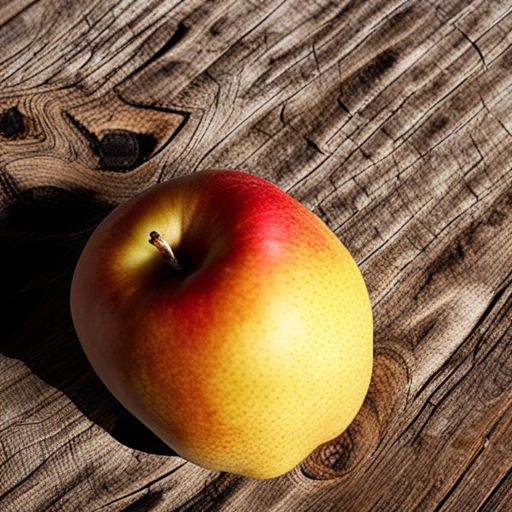
  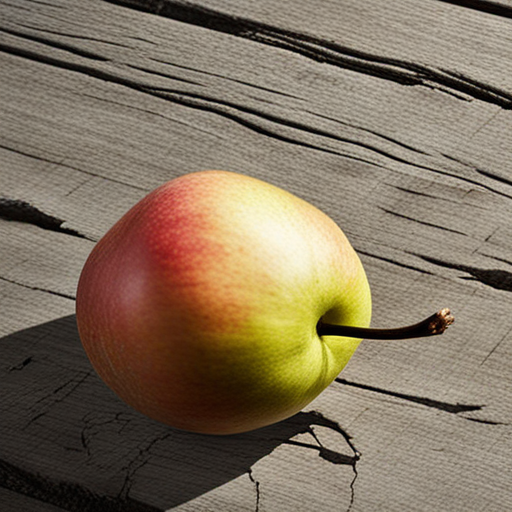

---

  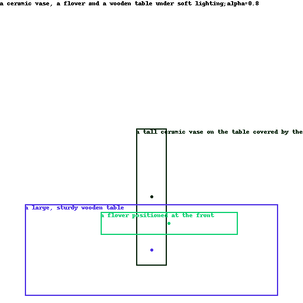
  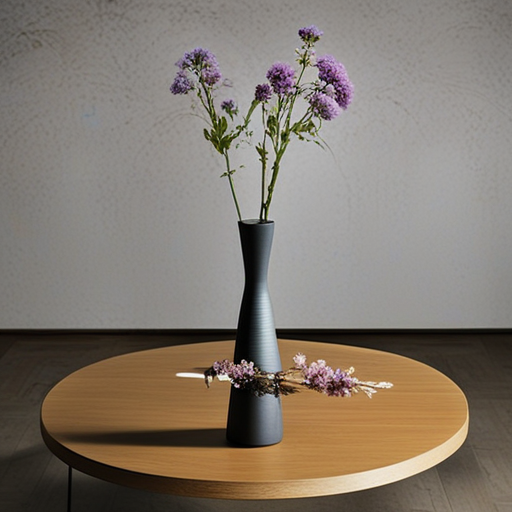
  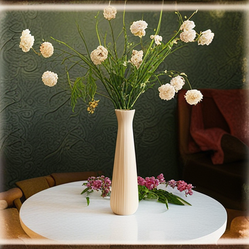
  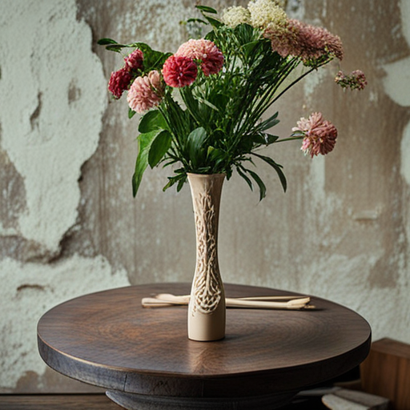

---

  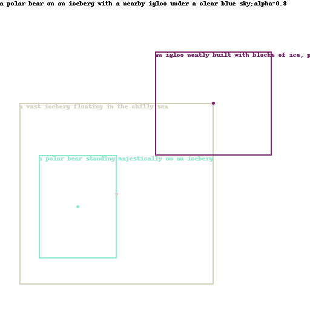
  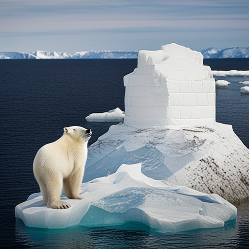
  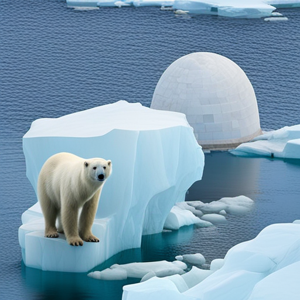

---

  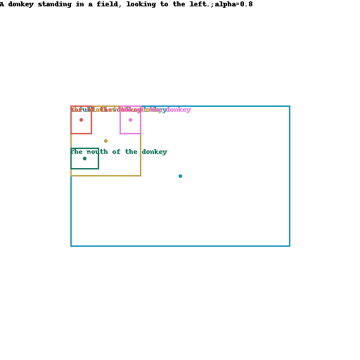
  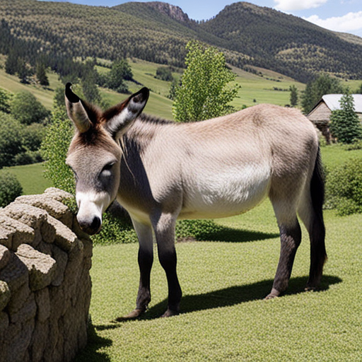

  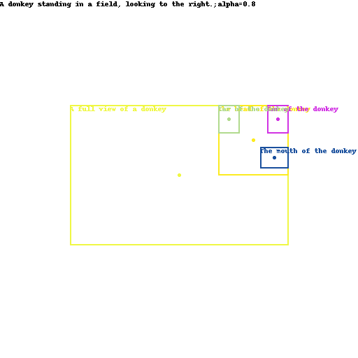
  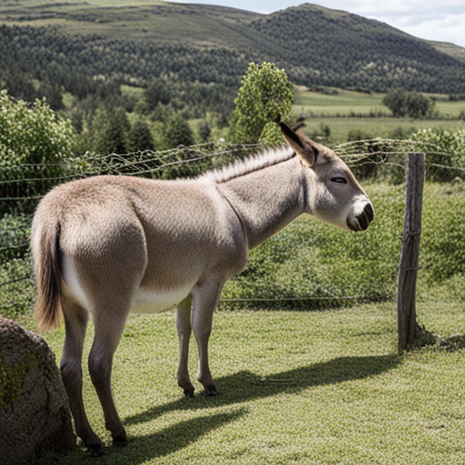

  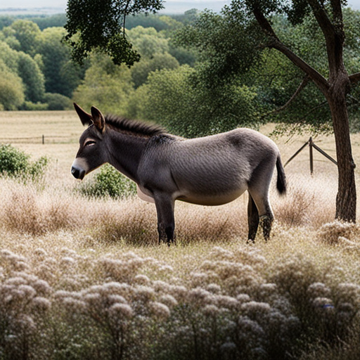
  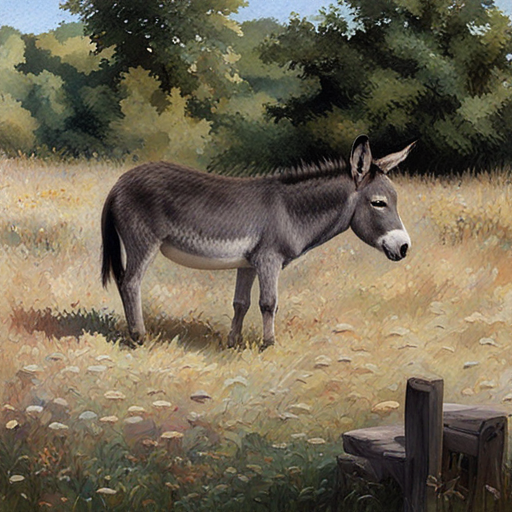

Donkey looking to the left and right (went wrong):

  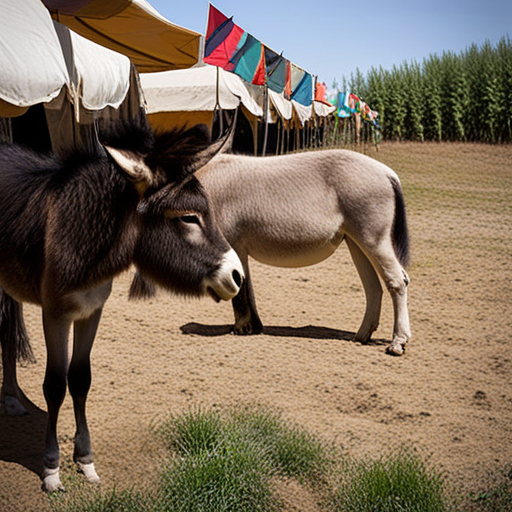
  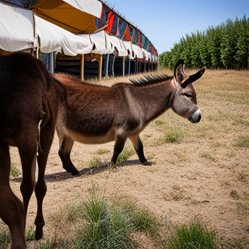

